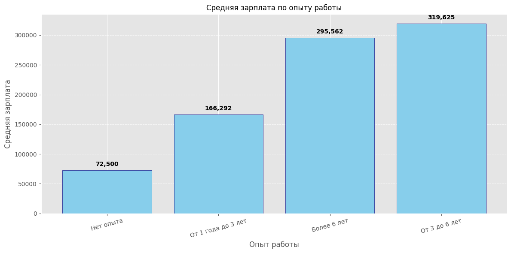

# 📊 Data Science & ML Job Market Analyzer

Пет-проект для автоматизированного сбора, очистки и визуального анализа рынка вакансий Data Scientist и Machine Learning Engineer с использованием открытого API hh.ru. Проект демонстрирует полный пайплайн Exploratory Data Analysis (EDA).

---

## 🚀 Описание работы скрипта (Логи выполнения)

### **Блок 1: Сбор сырых данных (Data Collection)**
Скрипт стучится к API HeadHunter и собирает первые 5 страниц поиска:

Начинаем поиск по запросу: Data Scientist OR Machine Learning Engineer...
Спарсили страницу 1 из 5. Найдено вакансий: 100
Спарсили страницу 2 из 5. Найдено вакансий: 100
Спарсили страницу 3 из 5. Найдено вакансий: 100
Спарсили страницу 4 из 5. Найдено вакансий: 67
Спарсили страницу 5 из 5. Найдено вакансий: 0

Всего сырых вакансий: 367
Структура полученных данных (ключи одной вакансии):
['id', 'premium', 'name', 'department', 'has_test', 'response_letter_required', 'area', 'salary', 'salary_range', 'type', 'address', 'response_url', 'sort_point_distance', 'published_at', 'created_at', 'archived', 'apply_alternate_url', 'show_logo_in_search', 'show_contacts', 'insider_interview', 'url', 'alternate_url', 'relations', 'employer', 'snippet', 'contacts', 'schedule', 'working_days', 'working_time_intervals', 'working_time_modes', 'accept_temporary', 'fly_in_fly_out_duration', 'work_format', 'working_hours', 'work_schedule_by_days', 'accept_labor_contract', 'civil_law_contracts', 'night_shifts', 'professional_roles', 'accept_incomplete_resumes', 'experience', 'employment', 'employment_form', 'internship', 'adv_response_url', 'is_adv_vacancy', 'adv_context']

---

### **Блок 2: Первичная оценка данных**
Из 367 найденных вакансий работодатели крайне редко указывают зарплатные вилки, что типично для рынка IT:

Всего скачано вакансий: 367
Указана зарплата от: 48
Указана зарплата до: 35

---

### **Блок 3: Очистка и статистика по ЗП**
После фильтрации пустых значений и перевода валют в рубли, мы получили чистую выборку для анализа.

Осталось вакансий для анализа (в рублях с конкретной ЗП): 52

| Требуемый опыт | Средняя ЗП (руб.) | Количество вакансий |
| :--- | ---: | ---: |
| Нет опыта | 72 500 | 2 |
| От 1 года до 3 лет | 166 293 | 14 |
| От 3 до 6 лет | 319 625 | 20 |
| Более 6 лет | 295 562 | 16 |

---

## 📈 Визуализация и Инсайты

### **Блок 4: Зависимость зарплаты от опыта работы**

Наблюдается классический экспоненциальный рост дохода при переходе от уровня Junior (1-3 года) к Middle/Senior (3-6 лет).

### **Блок 5: Востребованность навыков и мат. базы**
Python является абсолютным лидером и индустриальным стандартом. За ним следуют инструменты глубокого обучения (DL Frameworks) и инфраструктуры (ML Infrastructure).

### **Блок 6: Диаграмма рассеяния и Топ-3 вакансий**
Интерактивный анализ (опыт vs ЗП vs скилл-фактор).

Коэффициент корреляции (Навыки/ЗП): -0.01
**Примечание исследователя:** Нулевая/отрицательная корреляция является рыночной аномалией. Data Profiling показал, что в топовых вакансиях (Lead/Senior) работодатели часто не перечисляют базовые навыки в сниппете, подразумевая их по умолчанию, что требует более глубокого парсинга полных текстов вакансий.

---

### 🏆 ТОП-3 самых высокооплачиваемых вакансий:

| 💰 Зарплата | 📌 Должность | 🏢 Компания | 📊 Скилл-фактор |
| :---: | :--- | :--- | :---: |
| **640 000 руб.** | ML Engineer (Medical Imaging) | ГравиЛинк | 2 |
| **459 000 руб.** | TL Data Scientist | Платформа ОФД | 2 |
| **450 000 руб.** | Senior Data Scientist (Pricing & Promo Personalization) | Mindbox | 2 |

